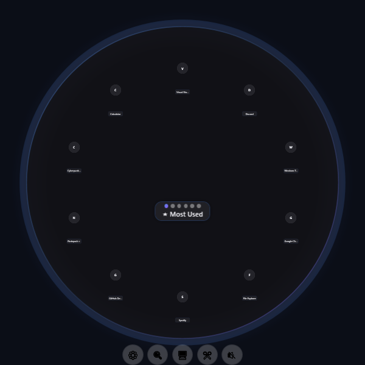
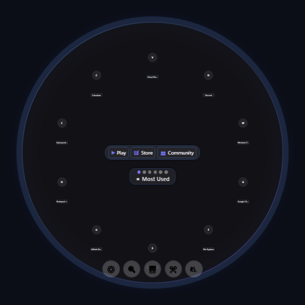
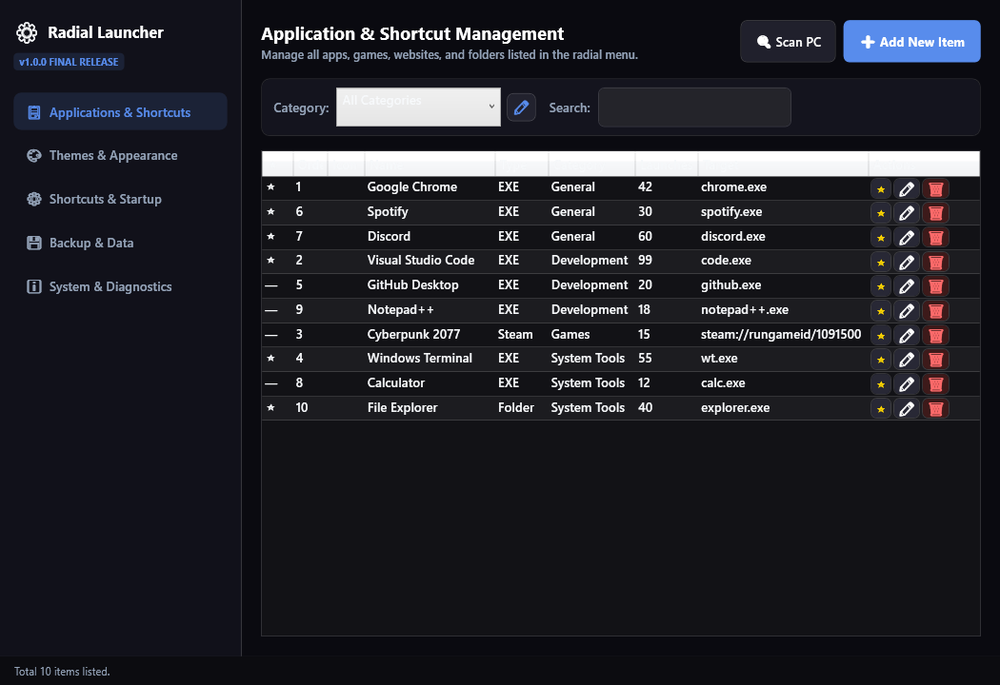
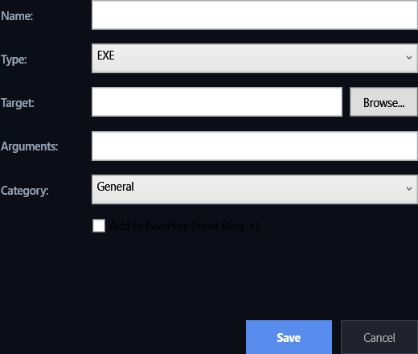
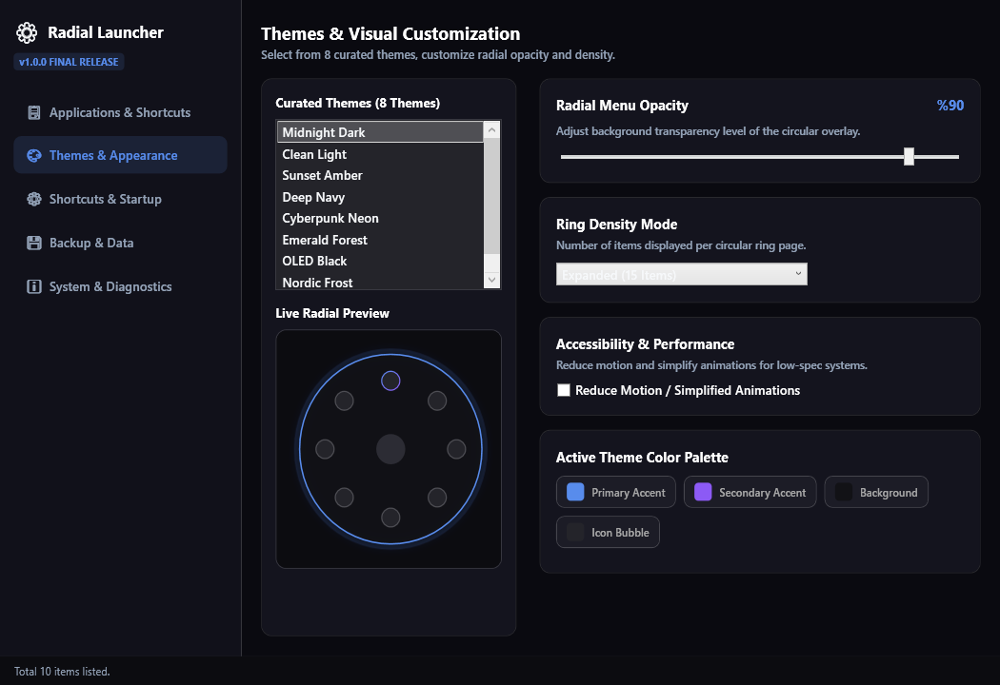
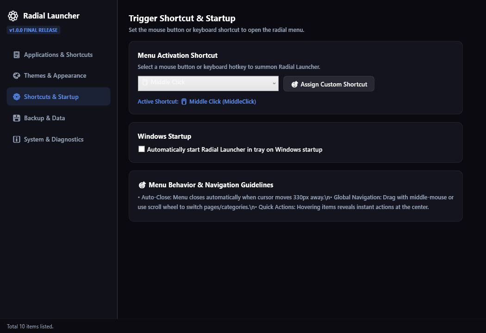
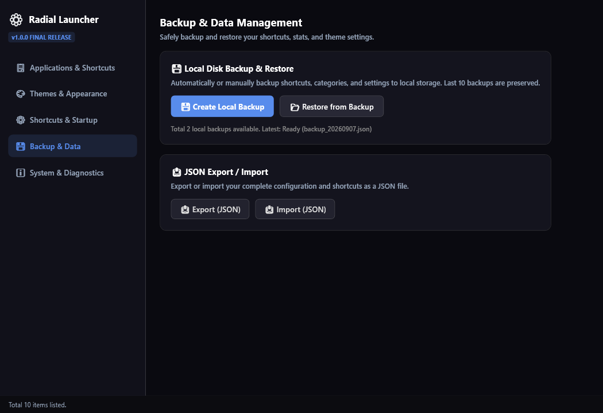
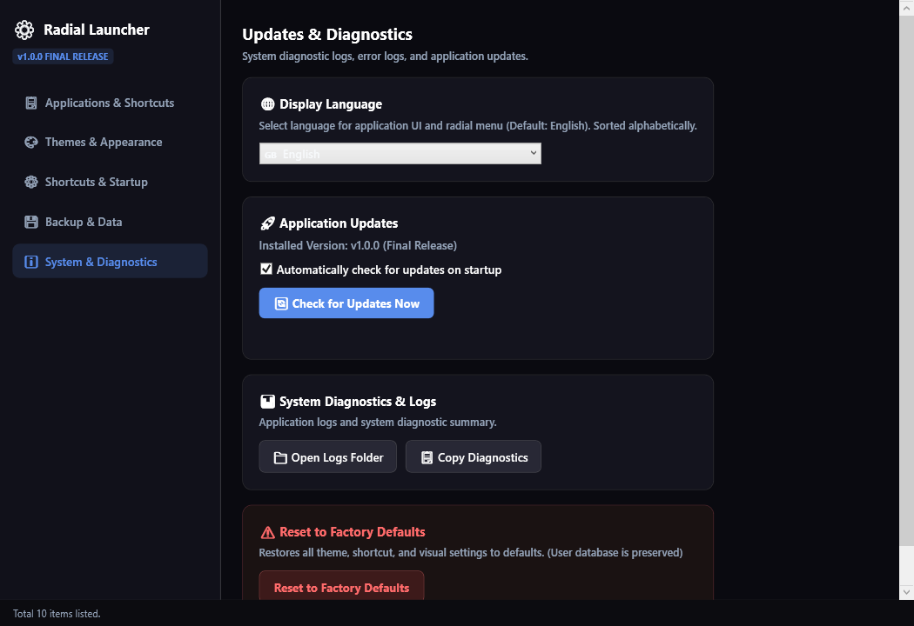
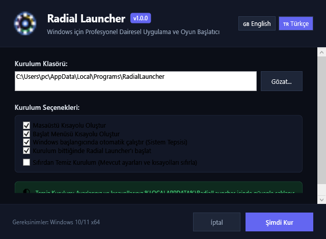

# ⚡ Radial Launcher

<p align="center">
  
</p>

<p align="center">
  <strong>Ultra-Fast, Futuristic Circular Application & Game Launcher for Windows 10 & 11</strong><br>
  <em>Summon your workspace, running task manager applications, Steam/Epic games, and web tools in milliseconds with smooth radial gestures.</em>
</p>

<p align="center">
  <a href="https://github.com/mephisto-mert/radial/releases/latest"></a>
  
  
  
  
  
</p>

---

## 🌟 Overview

**Radial Launcher** is a modern, high-performance, keyboard-and-mouse driven circular launcher designed for Windows 10 and 11. Built with WPF and .NET 7, it eliminates desktop clutter, crowded taskbars, and slow start menus by providing an instantaneous, aesthetic circular ring HUD at your mouse cursor.

Summon it anywhere on your screen using your **Mouse Middle Click**, **Side Mouse Buttons (XButton 1/2)**, or a custom hotkey like **`Alt + Space`**.

---

## 📖 Visual Walkthrough & User Guide

### 1. Instant Radial HUD & Smooth Circular Gestures
> *Summon your entire application ring around your cursor with smooth 60 FPS spring animations.*

<p align="center">
  
</p>

- **How to Summon**: Click your **Mouse Middle Button**, **Side Mouse Buttons**, or press **`Alt + Space`**.
- **How to Launch**: Simply left-click on any slice icon to launch the application, Steam game, or website.
- **Fast Page & Category Switching**: Scroll your mouse wheel up/down anywhere over the HUD or click the category tabs along the top to cycle rings effortlessly.
- **Auto-Dismissal**: The launcher closes automatically when clicking outside or moving past the radial boundary.

---

### 2. Centered Contextual Quick Actions Micro-HUD
> *Hover over any item to inspect its path and access instant context commands right in the center.*

<p align="center">
  
</p>

- **Instant Actions on Hover**:
  - ▶ **Launch / Play**: Launch the application or game normally.
  - ⚡ **Run as Administrator**: Elevate permissions on demand for developer tools and installers.
  - 📁 **Open File Location**: Instantly open the directory containing the target executable.
  - 🛒 **Steam Store / Community**: Quick shortcuts for Steam games to visit store and community hubs.
  - ⭐ **Toggle Favorite**: Pin items to your favorite shortcuts ring.

---

### 3. Application Management, Task Manager Scanner & URL Links
> *Discover installed Steam games, Epic Games, Desktop shortcuts, and active Task Manager apps with one click.*

<p align="center">
  
</p>

<p align="center">
  
</p>

- **Deep Automated PC Scanner**: Automatically indexes Steam game manifests (`steamapps/libraryfolders.vdf`), Epic Games, desktop `.lnk` files, and actively running Windows Task Manager processes.
- **Smart URL & Website Links**: Add any web tool (e.g. `google.com`, `youtube.com`, `github.com`). Radial Launcher automatically detects protocols, fetches icons, and opens in your default browser.
- **Built-in System Tools**: Control Volume Up/Down, Mute, Media Play/Pause, Snipping Tool, Task Manager, and Lock PC directly from your radial ring.

---

### 4. Curated High-Contrast Themes & Real-Time Appearance
> *Choose from 8 curated themes with dynamic perceived luminance and contrast calculation.*

<p align="center">
  
</p>

- **8 Curated Themes**: **Dark**, **Light**, **Midnight Blue**, **Cyberpunk**, **Forest**, **Crimson**, **Obsidian**, and **AMOLED Black**.
- **Dynamic Contrast Engine**: Guarantees ultra-sharp text readability across light and dark modes with automated luminance calculations on all ComboBoxes and dropdowns.
- **Ring Density & Customization**: Switch between **Expanded** (15 items/page) and **Compact** (18 items/page), and fine-tune background opacity and blur effects.

---

### 5. Customizable Hotkeys, Mouse Triggers & Windows Startup
> *Configure activation shortcuts and background system tray behavior.*

<p align="center">
  
</p>

- **Interactive Shortcut Picker**: Set any combination of modifiers and keys (`Alt + Space`, `Ctrl + Shift + Q`, `F1-F12`).
- **Mouse Button Triggers**: Trigger via Mouse Middle Click, XButton1 (Back), or XButton2 (Forward).
- **Windows Tray & Startup**: Start automatically in the background on Windows boot without blocking system startup.

---

### 6. Local Rolling Backups & Self-Contained Portability
> *100% offline data security with automated rolling backups and JSON portability.*

<p align="center">
  
</p>

- **Automated Rolling Backups**: Automatically creates and maintains up to 10 rotating database snapshots.
- **JSON Import / Export**: Transfer and sync your entire configuration across machines effortlessly.
- **Self-Contained Isolated Mode**: Every installation uses its own isolated `./data/` folder (via `portable.mode`), guaranteeing zero data pollution across different folders or USB drives.

---

### 7. Pure Dual-Language System & Diagnostics
> *Complete symmetric localization in English 🇬🇧 and Turkish 🇹🇷 with live log inspection.*

<p align="center">
  
</p>

- **Instant Language Switcher**: Switch between **🇬🇧 English** and **🇹🇷 Türkçe** instantly across 100% of all UI views without restarting.
- **Diagnostics & Health**: View real-time application logs, active SQLite database path, and system statistics.

---

### 8. Standalone Setup Wizard & Zero-Install Portable
> *Clean installation wizard with customizable paths and Clean Install toggle.*

<p align="center">
  
</p>

---

## 🚀 Download & Installation

### Option 1: Standalone Windows Installer (Recommended)
1. Download **[`RadialLauncher-Setup-v1.0.0.exe`](https://github.com/mephisto-mert/radial/releases/latest)** from GitHub Releases.
2. Run the installer, select your preferred language (**🇬🇧 English** or **🇹🇷 Türkçe**), choose installation options, and click **Install Now**.
3. Radial Launcher will configure Desktop and Start Menu shortcuts and start running in your system tray.

### Option 2: Portable Zero-Install ZIP
1. Download **[`RadialLauncher-1.0.0-win-x64.zip`](https://github.com/mephisto-mert/radial/releases/latest)** from GitHub Releases.
2. Extract the archive anywhere on your PC or USB flash drive.
3. Launch `RadialLauncher.exe` directly (all configuration and shortcuts remain self-contained in the local `./data/` folder).

---

## 🎮 Default Controls & Shortcuts Summary

| Action | Default Shortcut | Description |
| :--- | :--- | :--- |
| **Summon / Dismiss HUD** | `Middle Click` / `XButton1` / `Alt + Space` | Opens the radial ring at the current mouse position. |
| **Launch Item** | `Left Click` on Item | Launches the selected application, game, file, or website. |
| **Context Actions Micro-HUD** | `Hover` over Item | Reveals centered quick actions (Play, Run as Admin, Open Folder). |
| **Cycle Categories / Pages** | `Scroll Wheel` or `Tabs` | Rapidly rotates through categories and page rings. |
| **Open Management Dashboard** | Right-Click Tray Icon ➔ `Settings` | Opens the comprehensive 5-tab configuration center. |
| **Exit Application** | Right-Click Tray Icon ➔ `Exit` | Closes Radial Launcher completely. |

---

## 🛠️ Building from Source

### Prerequisites
- Windows 10 (Build 19041+) or Windows 11 x64
- [.NET 7.0 SDK](https://dotnet.microsoft.com/download/dotnet/7.0) (x64)
- Visual Studio 2022 (v17.4+) with *.NET Desktop Development* workload (or VS Code / .NET CLI)

### Build Commands

```powershell
# 1. Clone the repository
git clone https://github.com/mephisto-mert/radial.git
cd radial

# 2. Restore dependencies
dotnet restore

# 3. Run all unit & integration tests (171 tests)
dotnet test -c Release

# 4. Build and run locally
dotnet run --project RadialLauncher.csproj -c Release

# 5. Build full release package & standalone setup installer
powershell -ExecutionPolicy Bypass -File scripts/package.ps1
```

---

## 🛡️ Privacy & Security

- **Zero Telemetry**: Radial Launcher does not collect, log, or transmit any user data or usage metrics.
- **Local SQLite Database**: All shortcuts, categories, and settings are stored locally on your own storage.
- **Safe Process Execution**: Executables, games, and web links are invoked through standard Windows Win32 APIs without elevated escalation unless explicitly requested via "Run as Administrator".

---

## 📄 License

Radial Launcher is open-source software licensed under the **[MIT License](LICENSE)**.
