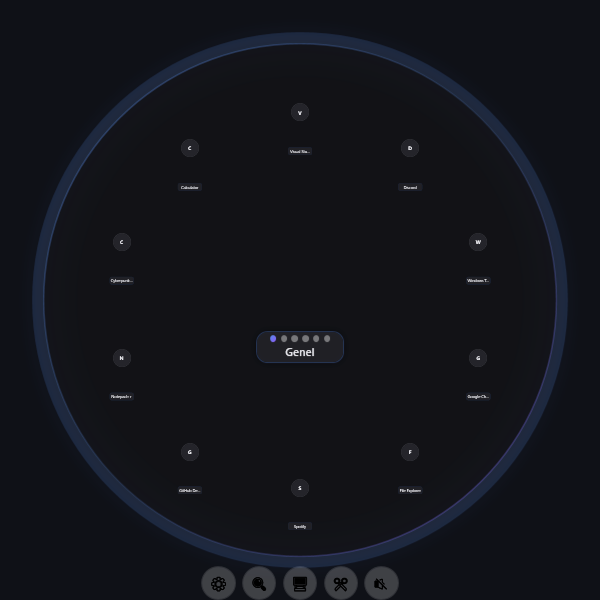
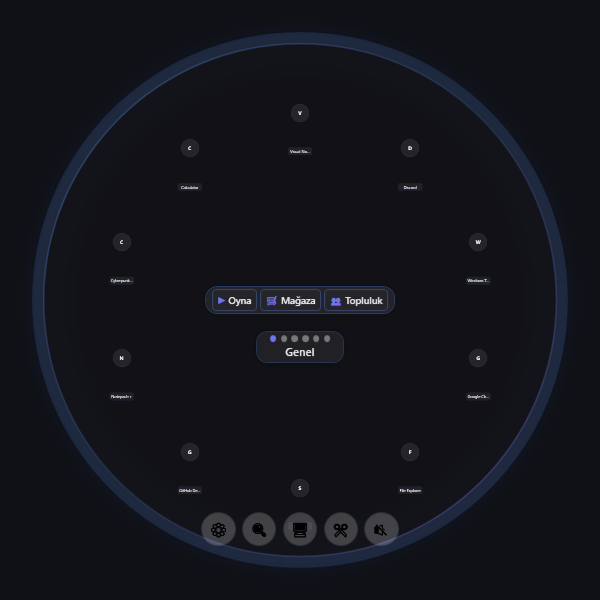
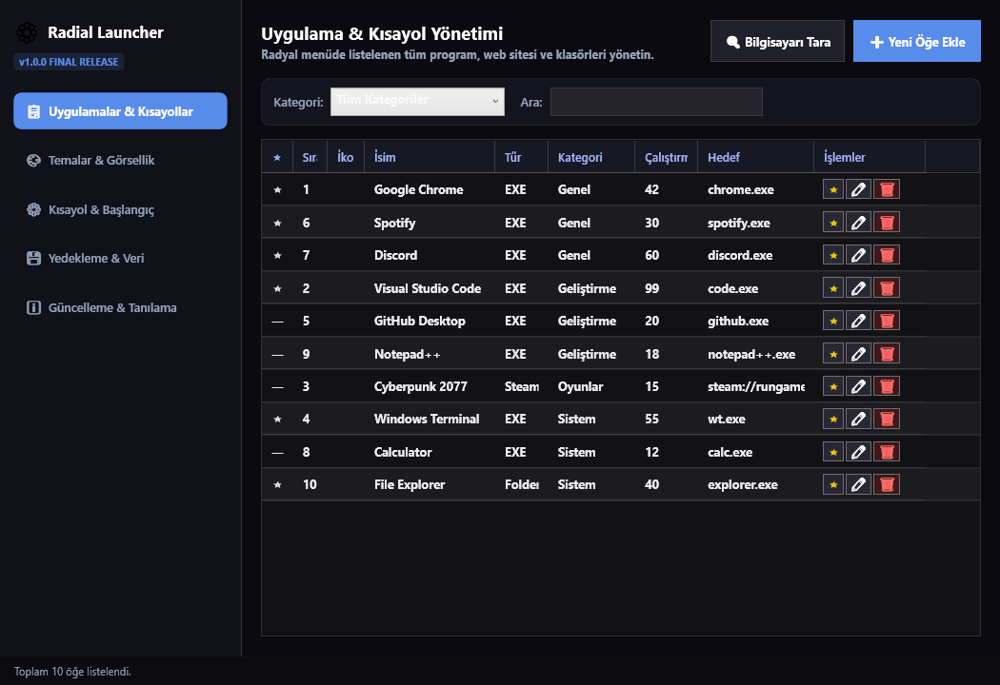
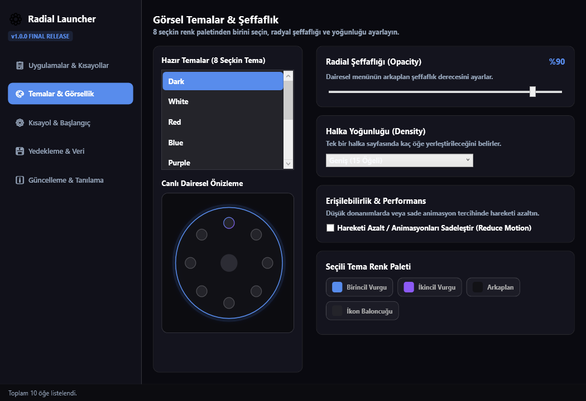
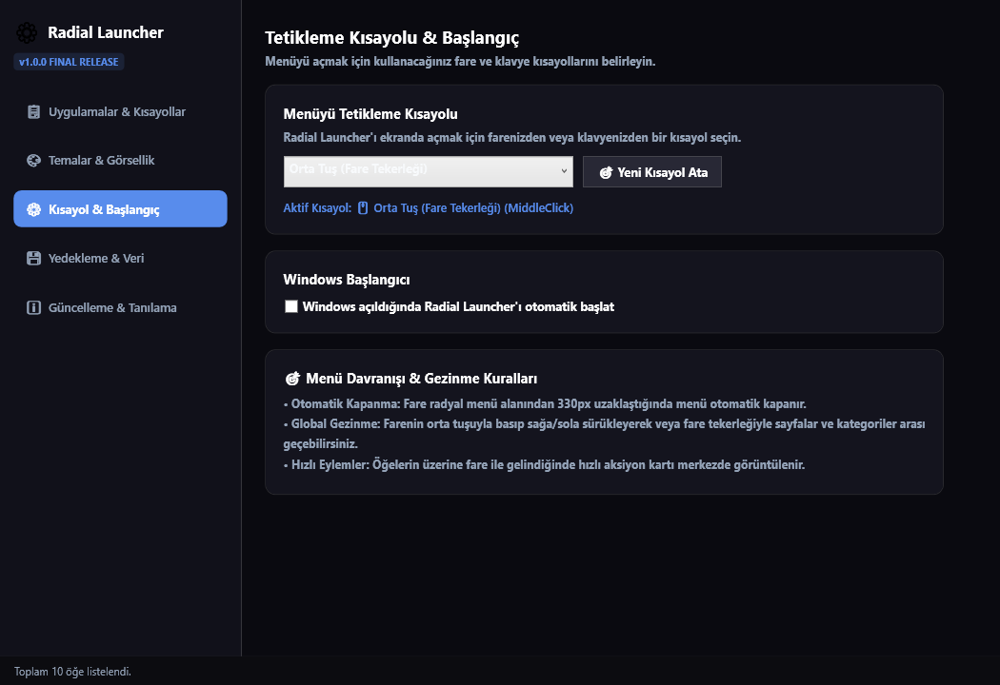
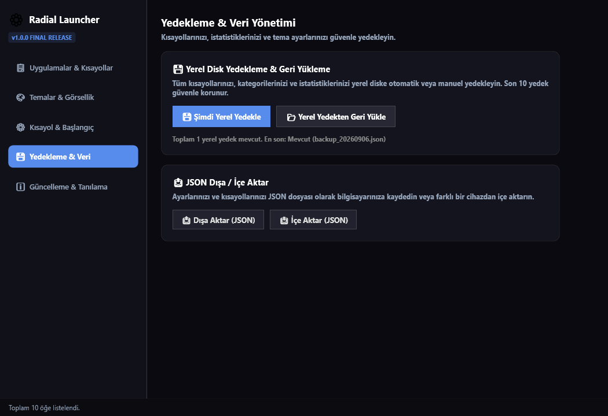
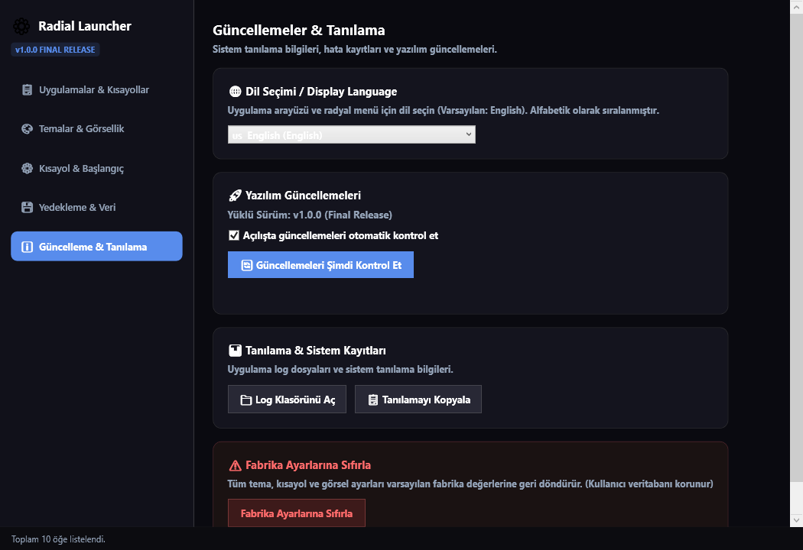

# ⚡ Radial Launcher

  

  <strong>Ultra-Fast, Futuristic Circular Application & Game Launcher for Windows 10 & 11</strong> 
  <em>Summon your entire workspace, favorite games, system controls, and websites in a fraction of a second with smooth radial gestures.</em>

  
  
  
  
  
  

---

## 🌟 Overview

**Radial Launcher** is a high-performance, keyboard-and-mouse driven radial launcher built with WPF and .NET 7. Designed for power users, gamers, and developers, it replaces cluttered desktop shortcuts and cumbersome taskbars with an intuitive, aesthetic circular ring HUD.

Summon it instantly anywhere on your screen using your **Mouse Middle Click**, **Side Buttons (XButton1/2)**, or a custom hotkey like `Alt + Space`.

---

## 📸 Screenshots & Visual Walkthrough

### 1. Circular Ring Overlay & Cinematic Clockwise Bloom
> Smooth sequential clockwise cascade animation when switching categories or pages.

  

### 2. Centered Contextual Quick Actions Micro HUD
> Hover over any Steam game, executable, or tool to reveal instant actions (▶ Play, 🛒 Store, 👥 Community, 📁 Location, ⚡ Run as Admin) without overlapping radial bubbles.

  

### 3. Application & Shortcut Management (Tab 1)
> Search, filter by category, sort by usage or position, and trigger automated full-PC scanning.

  

### 4. Curated Themes & Appearance (Tab 2)
> 8 curated color themes (Dark, White, Red, Blue, Purple, Forest, AMOLED Black, High Contrast) with real-time contrast checking and ring density controls.

  

### 5. Activation Hotkeys & Windows Startup (Tab 3)
> Interactive shortcut picker for mouse and keyboard triggers with auto-closing perimeter boundaries.

  

### 6. Local Backups & Data Portability (Tab 4)
> Automated rolling backups (keeps last 10 backups) and JSON Import/Export for seamless multi-device migration.

  

### 7. Multi-Language Support & Diagnostics (Tab 5)
> 10+ natively translated languages sorted alphabetically with one-click GitHub update checks.

  

---

## ✨ Key Features

| Feature | Description |
| :--- | :--- |
| 🏎️ **Ultra-Fast Radial HUD** | 60 FPS hardware-accelerated animations with spring easing and 3x cinematic clockwise bloom. |
| 🎮 **Auto Game Detection** | Automatically detects Steam & Epic Games libraries with custom protocol execution. |
| 🔍 **Deep PC Scanner** | Automatically discovers installed software, desktop shortcuts, and Windows Store apps. |
| ⚡ **Contextual Actions** | Quick action micro HUD for games and apps (Run as Administrator, Open File Location, Steam Store). |
| 🌐 **10+ Languages** | Deutsch, English (Primary), Español, Français, Italiano, Japanese, Korean, Polish, Portuguese (BR), Russian, Turkish. |
| 🎨 **Theme Engine** | 8+ dark/light palettes, wallpaper accent color extraction, and dynamic ring opacity slider. |
| 🛡️ **Zero Telemetry & 100% Local** | All database and configuration files are stored safely in `%LOCALAPPDATA%\RadialLauncher`. No cloud tracking. |
| 📦 **Clean Standalone Installer** | Includes both a modern dark GUI setup wizard (`RadialLauncher-Setup-v1.0.0.exe`) and portable zip. |

---

## 🚀 Download & Installation

### Option 1: Standalone Windows Installer (Recommended)
1. Download **`RadialLauncher-Setup-v1.0.0.exe`** from [GitHub Releases](https://github.com/mephisto-mert/radial/releases/latest).
2. Run the installer, select your installation folder (Default: `%LOCALAPPDATA%\Programs\RadialLauncher`), and click **Install**.
3. Radial Launcher will automatically create desktop & start menu shortcuts and launch in the system tray.

### Option 2: Portable ZIP
1. Download **`RadialLauncher-1.0.0-win-x64.zip`**.
2. Extract to any directory and run `RadialLauncher.exe`.

---

## 🎮 Default Controls & Navigation

- **Summon / Dismiss Overlay**: `Mouse Middle Click` or `Alt + Space`
- **Switch Categories / Pages**: Middle Click & Drag Left/Right or use `Mouse Scroll Wheel`
- **Select / Launch Item**: `Left Click` on any radial icon
- **Contextual Quick Actions**: Hover mouse over any item to reveal centered quick actions
- **Auto-Dismiss**: Moving the mouse 330px away from the menu automatically hides the radial overlay
- **Open Settings**: Click the center gear icon or right-click the system tray icon

---

## 🛠️ Technology Stack & Architecture

- **Framework**: .NET 7.0 (Windows WPF x64)
- **Database**: SQLite with Dapper ORM & WAL Mode (`Microsoft.Data.Sqlite`, `Dapper`)
- **MVVM Pattern**: CommunityToolkit.Mvvm
- **Tray & Notifications**: Hardcodet.NotifyIcon.Wpf
- **Logging**: Serilog file sink with rolling audit logs
- **Packaging**: Standalone WPF Setup Wizard + Inno Setup Script

---

## 🏷️ Keywords & Tags

`radial-launcher` `app-launcher` `game-launcher` `radial-menu` `pie-menu` `windows11` `windows10` `wpf` `csharp` `dotnet` `productivity` `hotkey-launcher` `fluent-design` `quick-access` `open-source` `steam-launcher`

---

## 📄 License

This project is licensed under the [MIT License](LICENSE).
